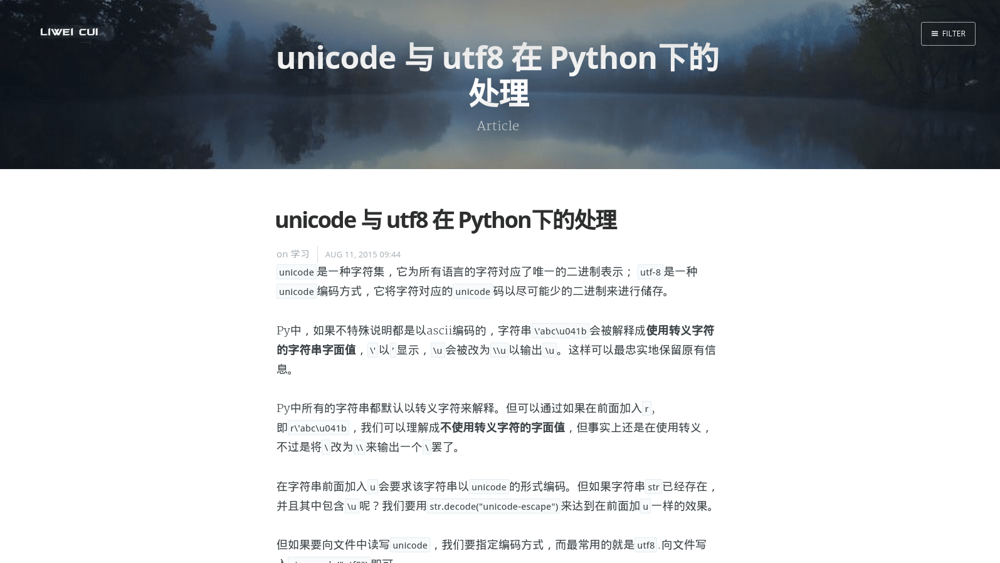
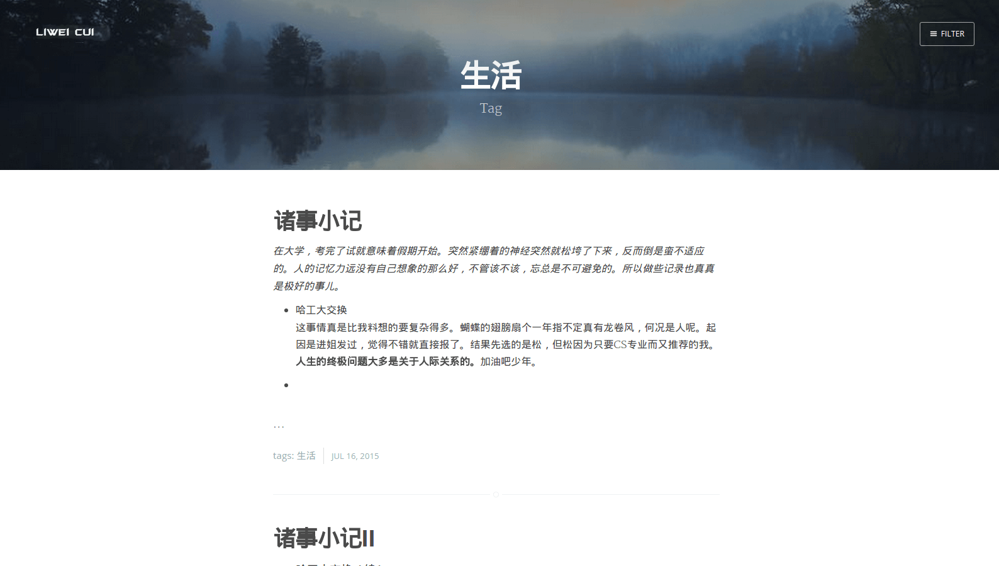

#My Blog#
##介绍##
这是一个基于Django的个人博客，主要用于自娱自乐…[链接见此](www.hellolw.com) 

##特色##
* 首页图片及文字随打开时间变化
* 根据标签筛选文章
* 文章使用Markdown语法
* 基于多说的评论系统
* 域名部署于~~SAE~~ UESTC library
* 域名邮箱(cui@hellolw.com)

##截图##

 


 





##如何配置？##
*编写`Django`应用程序的时候可以将所有静态文件放在`Django`应用目录下（或者写完后使用`manager.py collectstatic`来收集静态文件到应用目录下）*

这里要讲的是通过`apache2`与`mod-wsgi`来完成部署：

0. 修改应用下默认生成的`wsgi.py`(`newBlog`随机应变～):
```
import os
import sys

# add this
PROJECT_DIR = os.path.dirname(os.path.abspath(__file__))
sys.path.insert(0, PROJECT_DIR)

os.environ["DJANGO_SETTINGS_MODULE"] = 'newBlog.settings'
from django.core.wsgi import get_wsgi_application
application = get_wsgi_application()
```
1. 安装所需要的文件，不妨把能装的都装上:) `apt-get install mysql-server mysql-client apache2 python-mysqldb libapache2-mod-wsgi`
2.  在`/etc/apache2/sites-available`处新建配置文件，我的就叫`newBlog.conf`.
3. 在其中加入以下内容（`/home/lw/newBlog/`也需要随机应变.端口为80就不需要在`/etc/apache2/ports.conf`中加入`Listen 80`，这是默认的~）：
```
<VirtualHost *:80>
	# using site address to distinguish root dictionary with same IP and port
    ServerName www.hellolw.com
    DocumentRoot /home/lw/newBlog/

    <Directory /home/lw/newBlog>
	Require all granted
    </Directory>

    WSGIScriptAlias / /home/lw/newBlog/newBlog/wsgi.py
 </VirtualHost>

<VirtualHost *:80>
	# using site address to distinguish root dictionary with same IP and port
    ServerName list.xyz
    DocumentRoot /home/lw/file/

    <Directory /home/lw/file>
	#uncomment to enable file server
 	#Options Indexes FollowSymLinks
	Require all granted
    </Directory>

    WSGIScriptAlias / /home/lw/newBlog/newBlog/wsgi.py
 </VirtualHost>
```
4. 使网站生效：`a2ensite newBlog.conf`
5. 重启`apache2`： `/etc/init.d/apache2 restart`

这时打开`127.0.0.1`就可以看到网站啦，自此博客部署就算成功了。
另：`apache2.4`版本上使用`Require all granted`